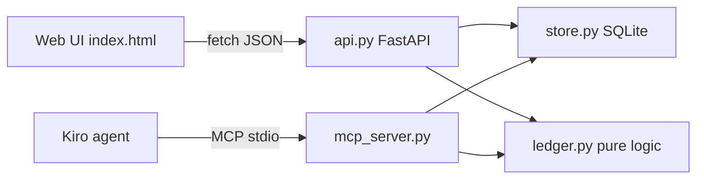

# Design Document

## Overview

SplitSmart is a layered Python app. A pure `ledger` module holds all money math; `store` persists data in
SQLite; `api` (FastAPI) and `mcp_server` (MCP SDK) are thin adapters over the same store and ledger.



## Components and Interfaces

### ledger.py (pure)
- `split_equal(amount_cents: int, participants: list[str]) -> dict[str, int]`
- `compute_balances(members: list[str], expenses: list[Expense]) -> dict[str, int]`
- `settle_up(balances: dict[str, int]) -> list[Transfer]` - greedy: repeatedly match the largest debtor with the
  largest creditor, transfer `min(|debt|, credit)`. Each step zeroes at least one member, so the plan has at most
  `n_nonzero - 1` transfers.
- `format_cents(amount_cents: int) -> str`

### store.py
SQLite tables: `groups(id, name)`, `members(group_id, name)`, `expenses(id, group_id, description, amount_cents, payer)`,
`expense_participants(expense_id, member, position)`. The DB path comes from `SPLITSMART_DB` (default `splitsmart.db`).

### api.py
| Method | Path | Purpose |
|---|---|---|
| POST | `/api/groups` | create group `{name, members[]}` |
| GET | `/api/groups` | list groups |
| GET | `/api/groups/{id}` | group with members and expenses |
| POST | `/api/groups/{id}/members` | add member |
| POST | `/api/groups/{id}/expenses` | add expense `{description, amount_cents, payer, participants[]}` |
| DELETE | `/api/groups/{id}/expenses/{expense_id}` | delete expense |
| GET | `/api/groups/{id}/balances` | balances |
| GET | `/api/groups/{id}/settle` | settle-up plan |

### mcp_server.py
Tools: `create_group`, `list_groups`, `add_member`, `add_expense`, `delete_expense`, `get_balances`, `settle_up`.

## Data Models

```python
@dataclass(frozen=True)
class Expense:
    description: str
    amount_cents: int
    payer: str
    participants: tuple[str, ...]


@dataclass(frozen=True)
class Transfer:
    from_member: str
    to_member: str
    amount_cents: int
```

## Correctness Properties

*A property is a characteristic or behavior that should hold true across all valid executions of a system.*

### Property 1: Split conserves money
*For any* positive amount and any non-empty list of distinct participants, the shares returned by `split_equal`
sum exactly to the amount, and any two shares differ by at most 1 cent.
**Validates: Requirements 2.2**

### Property 2: Balances sum to zero
*For any* set of members and any list of valid expenses, the sum of `compute_balances` is exactly 0.
**Validates: Requirements 3.1, 3.2**

### Property 3: Balances are order-independent
*For any* list of valid expenses and any permutation of it, `compute_balances` returns the same result.
**Validates: Requirements 3.3**

### Property 4: Deleting an expense is a perfect undo
*For any* list of expenses and any expense in it, balances without that expense equal balances computed as if it
was never added.
**Validates: Requirements 2.5**

### Property 5: Settle-up clears all debts
*For any* balances that sum to zero, applying every transfer from `settle_up` leaves all balances at exactly 0,
every transfer amount is a positive integer, and every transfer goes from a debtor to a creditor.
**Validates: Requirements 4.1, 4.2, 4.4**

### Property 6: Settle-up is minimal-bounded
*For any* balances that sum to zero, the number of transfers is at most (number of non-zero balances − 1),
and is 0 when all balances are 0.
**Validates: Requirements 4.3, 4.5**

### Property 7: Formatting round-trips
*For any* integer cents value, parsing `format_cents(x)` back as a decimal and multiplying by 100 yields `x`.
**Validates: Requirements 5.4**

## Error Handling
- Validation errors (bad amount, unknown member, duplicate names) → `ValueError` in store/ledger → HTTP 422 / MCP tool error.
- Unknown group/expense → `KeyError` → HTTP 404 / MCP tool error.

## Testing Strategy
- Property-based tests with `hypothesis` for Properties 1–7 (`tests/test_ledger_properties.py`), minimum 200 examples each.
- Example-based API tests with FastAPI `TestClient` against a temp SQLite DB (`tests/test_api.py`).
- MCP smoke test calling tools in-process (`tests/test_mcp.py`).
